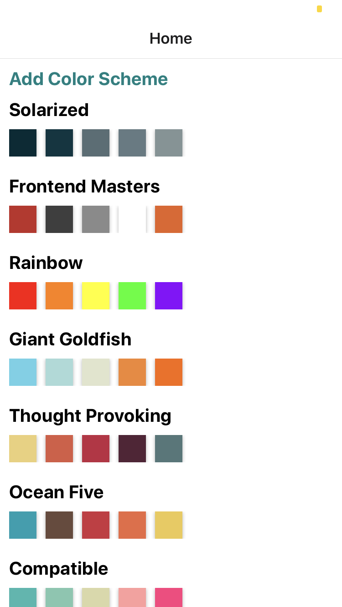
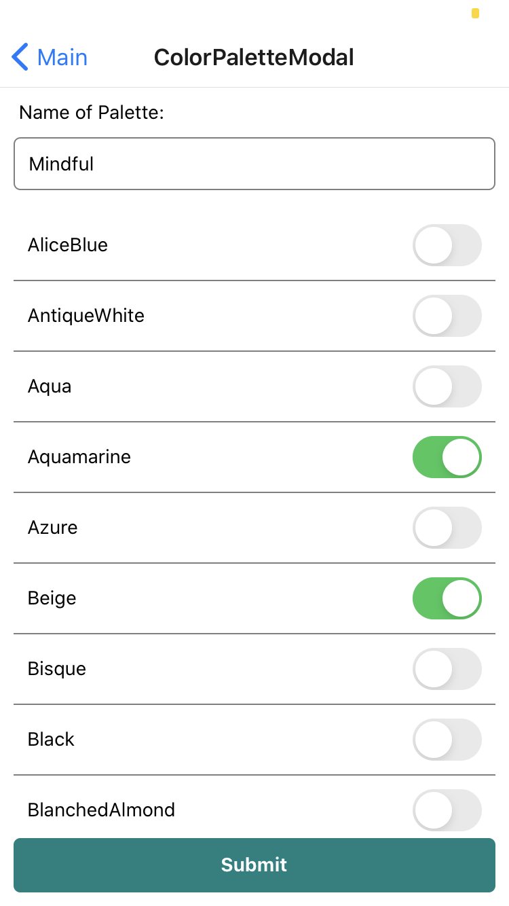
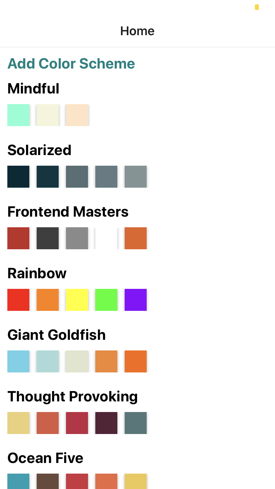
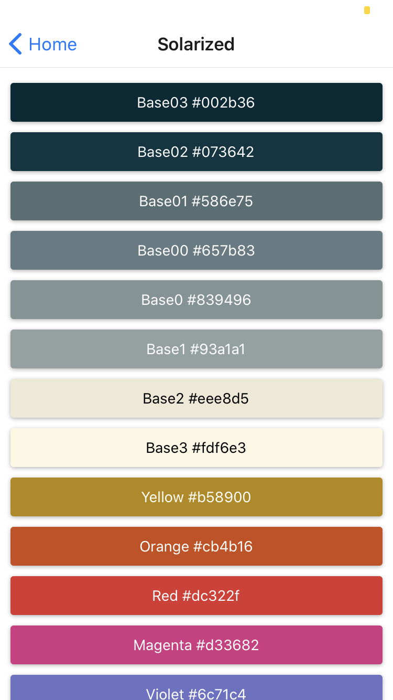

# REACTNative

# To run locally:(LINUX and macOS)
1. clone the repo.
2. install Node.js from https://nodejs.org/en/ and dependencies.
3. `npm install expo-cli --global`
4. `expo start`
5. Scan the QR code printed by expo start with Expo Client (Android) or Camera (iOS). Both, devices should be on same network.

   

